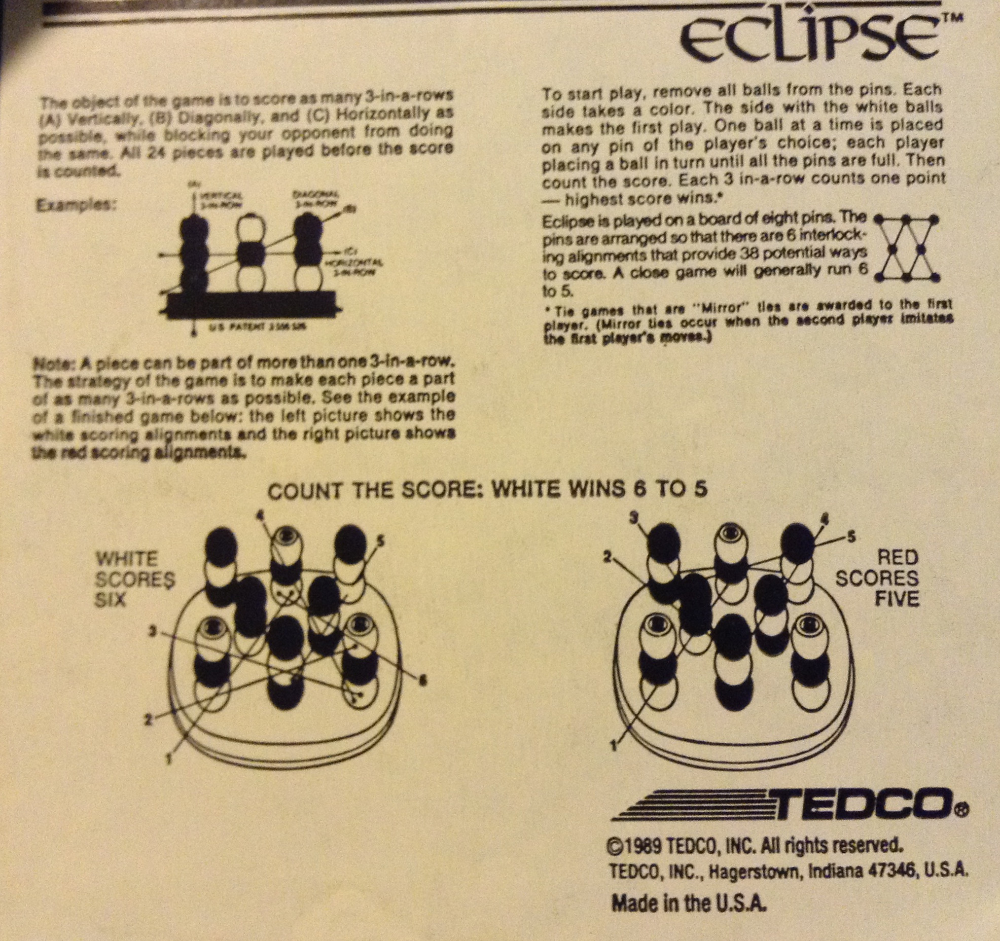

#Eclipse

This is a single-player only version of Eclipse, a board game that due to the name being a (relatively) common noun, and because it was published before the web was available outside universities, is impossible to find information on now. The best I can find is [the patent relating to the game board](https://www.google.com/patents/US3556526).

